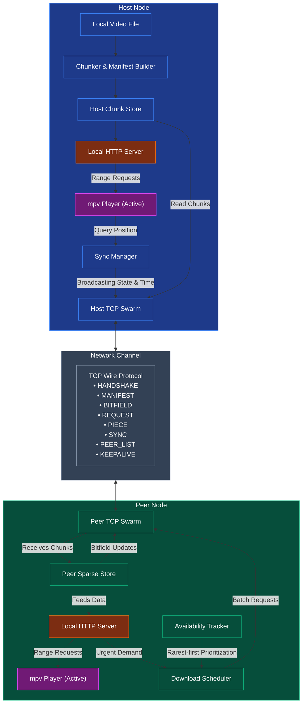
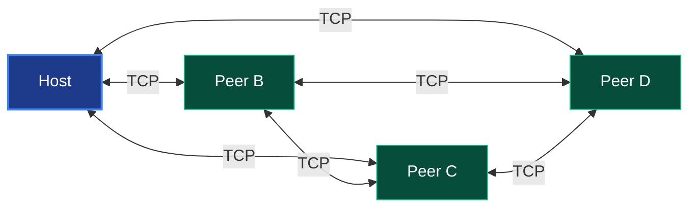
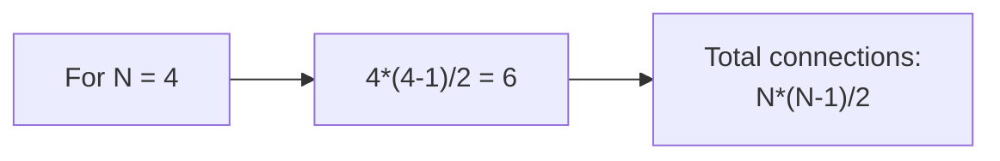

# PeerWatch — Architecture Overview

PeerWatch is a serverless, peer-to-peer CLI application for synchronized video
watching. One person hosts a video file; others join using a connection token.
There is no central server — peers transfer video chunks directly to each other,
BitTorrent-style, and play back in sync via mpv.

## How It Works (High Level)



1. **Host** runs `./peerwatch start movie.mp4`
   - Reads the file, computes SHA-256 hashes per chunk (512KB each)
   - Starts a TCP listener
   - Prints a connection token (base64-encoded host address + metadata)

2. **Peer** runs `./peerwatch join <token>`
   - Decodes the token to get the host's IP:port
   - Connects via TCP, receives the manifest (file metadata + chunk hashes)
   - Creates a sparse file and starts downloading chunks
   - Connects to all other peers (full mesh)

3. **Chunk Transfer**
   - Peers request chunks in batches (`RequestMsg` with multiple indices)
   - The responder sends back individual `PieceMsg` for each chunk
   - Every chunk is verified against its SHA-256 hash before being stored

4. **Availability Tracking**
   - Instead of per-chunk HAVE announcements, each peer broadcasts its full
     bitfield every ~1 second — simpler, fewer messages, self-correcting

5. **Playback**
   - A local HTTP server serves the video chunks to mpv via Range requests
   - The host broadcasts the playback position every 2s; peers adjust their playback speed or seek to match and synchronize.

## Network Topology

Full mesh — every peer connects to every other peer directly.





This is fine for 5-10 peers. Each connection is a single TCP socket with two
goroutines (reader + writer). At 10 peers, that's 18 goroutines — trivial.

## Chunk Strategy

- **Chunk size**: 512 KB fixed (last chunk may be smaller)
- **Identification**: 0-based integer index
- **Integrity**: SHA-256 per chunk, verified on receipt
- **Storage**: Host wraps original file; peers use a sparse file filled at
  correct byte offsets as chunks arrive

The scheduler uses a hybrid strategy:

1. **Playback window first** — sequential chunks near the playback cursor
2. **Rarest-first** — for remaining download capacity, prefer chunks that
   fewest peers have (improves swarm-wide distribution)

## Wire Protocol

Binary, length-prefixed framing over TCP:

```
[4 bytes: length][1 byte: type][payload bytes]
```

10 message types: HANDSHAKE, MANIFEST, BITFIELD, HAVE (reserved), REQUEST
(batch), PIECE, CANCEL, SYNC, PEER_LIST, KEEPALIVE.

See `docs/protocol_sequence.md` for the exact message ordering.
