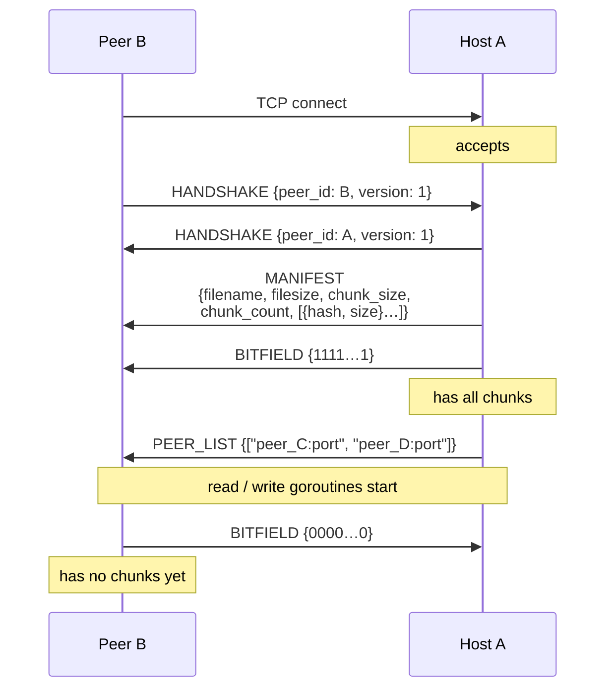
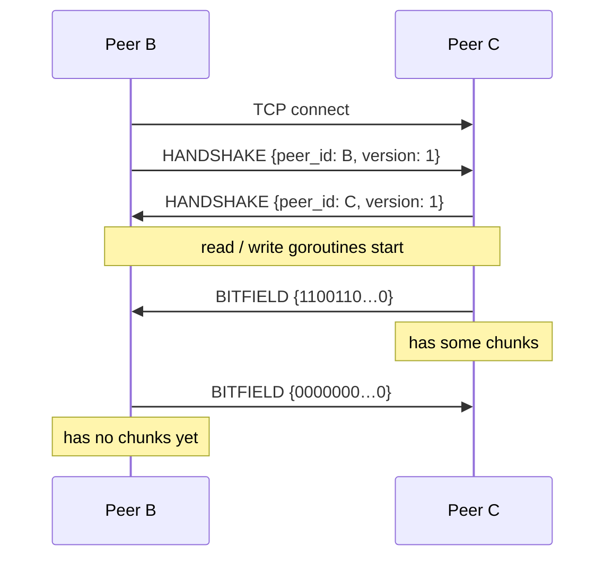
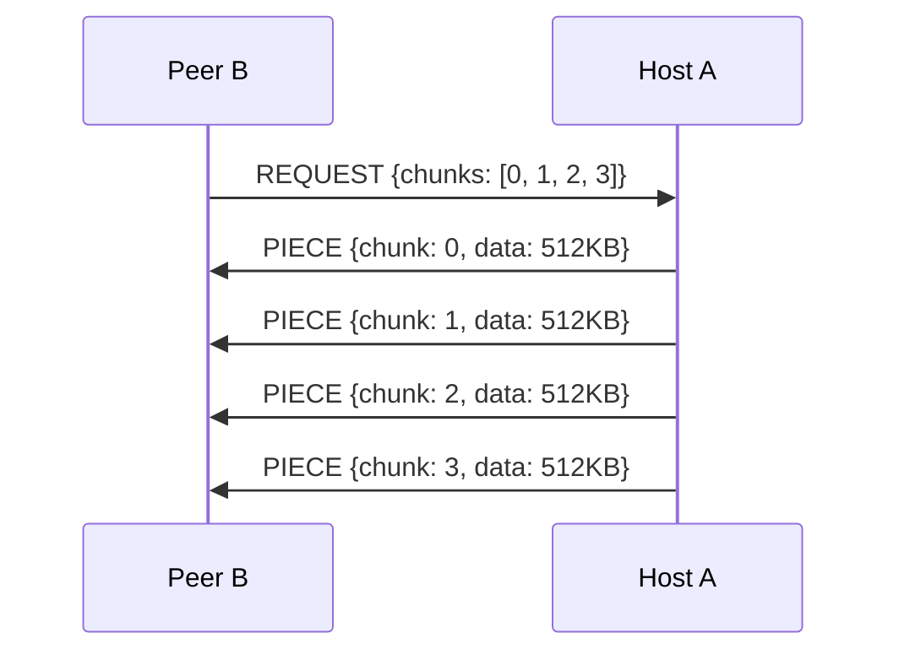
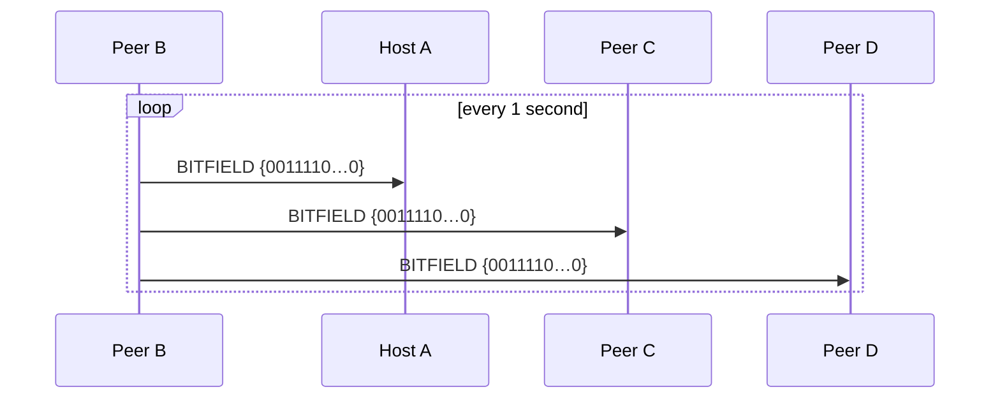

# Protocol Sequence — Message Ordering

This document defines the exact order of messages exchanged between peers
during connection setup and steady-state operation.

## 1. Peer Joins via Host

When a new peer (B) connects to the host (A), the following sequence occurs
**synchronously on the TCP connection** before the read/write goroutines start:



**Order matters.** The host sends HANDSHAKE → MANIFEST → BITFIELD → PEER_LIST
in this exact sequence. The peer reads them synchronously before starting its
read loop. This is why `ConnectToHost()` reads four messages in a row before
calling `peer.Start()`.

## 2. Peer Connects to Another Peer

After receiving the PEER_LIST from the host, peer B connects to each listed
peer. This is a **non-host** handshake — no manifest is sent:



Peer B already has the manifest from the host. Only bitfields are exchanged.

## 3. Steady-State: Chunk Download

Once connected, chunks are requested and transferred asynchronously:



- REQUEST is **batched** — multiple chunk indices in one message
- PIECE is **individual** — one chunk per message (they may be large, 512KB)
- Each received chunk is verified against its SHA-256 hash before being stored

## 4. Periodic Bitfield Broadcast

Every ~1 second, each peer sends its current bitfield to ALL connected peers:



This replaces per-chunk HAVE messages. It's self-correcting — if a bitfield
message is lost, the next one carries the full state.

The receiving peer updates:

1. The sender's `Peer.bitfield` (for `HasChunk` queries)
2. The `Tracker.availability` map (for rarity calculations)

## 5. Playback Sync (Phase 5)

Every 2 seconds, the host broadcasts its playback position:

```
Host A ──── SYNC {time: 45.2, state: PLAYING, unix_ms: ...} ──→ ALL peers
```

Peers compare their position and adjust:

- `|drift| > 2s` → hard seek
- `drift ∈ [-2, -0.5]` → speed up to 1.05x
- `drift ∈ [0.5, 2]` → slow down to 0.95x
- `|drift| < 0.5` → normal speed

## 6. Peer Disconnection

When a peer disconnects (TCP close or error):

1. The `readLoop` or `writeLoop` exits
2. `Peer.Close()` is called (via `sync.Once` — safe from multiple goroutines)
3. The `done` channel is closed
4. `Swarm.addPeer`'s monitor goroutine detects it and:
   - Removes the peer from `Swarm.peers`
   - Removes the peer from `Tracker.availability`
   - Logs the disconnection

No explicit "goodbye" message is sent. TCP close is the signal.

## Message Summary Table

| Message   | When Sent                          | By Whom     | Payload Size         |
| --------- | ---------------------------------- | ----------- | -------------------- |
| HANDSHAKE | On every new TCP connection        | Both sides  | 17 bytes             |
| MANIFEST  | After handshake (host→joiner only) | Host        | ~36×chunkCount bytes |
| BITFIELD  | After handshake + every 1s         | Everyone    | chunkCount/8 bytes   |
| REQUEST   | When scheduler needs chunks        | Downloaders | 8 + 4×N bytes        |
| PIECE     | In response to REQUEST             | Uploaders   | 4 + chunkSize bytes  |
| SYNC      | Every 2s (Phase 5)                 | Host        | 17 bytes             |
| PEER_LIST | After handshake (host→joiner)      | Host        | variable             |
| KEEPALIVE | Every 30s (Phase 6)                | Everyone    | 0 bytes              |
| HAVE      | _Reserved for v2_                  | —           | 8 bytes              |
| CANCEL    | _Not yet implemented_              | —           | 8 bytes              |
